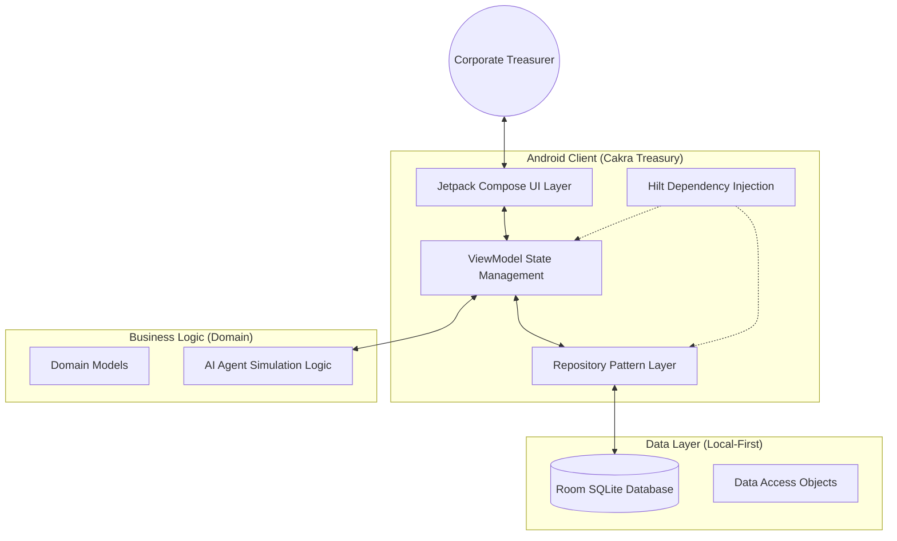
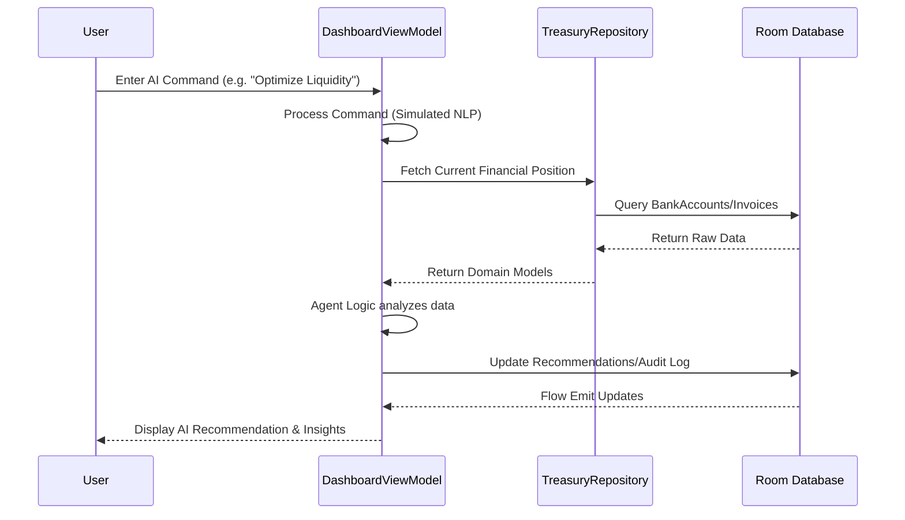

# Cakra Treasury: Next-Gen Autonomous Corporate Treasury Management

[](https://developer.android.com/android)
[](https://kotlinlang.org/)
[](https://developer.android.com/jetpack/compose)
[](https://dagger.dev/hilt/)

## 📌 Project Overview
Cakra Treasury is a production-ready, enterprise-grade Android application designed to revolutionize corporate treasury operations. It provides a centralized Command Center for liquidity management, risk mitigation, and automated financial execution. By leveraging a multi-agent architectural simulation, it offers treasurers real-time insights and autonomous recommendation engines to optimize working capital and mitigate FX risks.

### 💼 Business Problem Statement
Traditional treasury management often suffers from fragmented data, delayed visibility into cash positions, manual reconciliation processes, and slow response times to market volatility. These inefficiencies lead to idle cash, increased FX exposure, and missed investment opportunities.

### 🎯 Objectives
- **Centralized Visibility:** Consolidate bank accounts and financial positions into a single "Source of Truth".
- **Autonomous Intelligence:** Utilize specialized AI agents to analyze risk, liquidity, and compliance.
- **Operational Excellence:** Streamline working capital cycles (DSO/DPO) and automate routine treasury placements.
- **Security & Compliance:** Ensure every action is biometrically verified and recorded in an immutable audit trail.

---

## 📖 Table of Contents
1. [Architecture](#-architecture)
2. [Key Features](#-key-features)
3. [Technology Stack](#-technology-stack)
4. [Project Structure](#-project-structure)
5. [Getting Started](#-getting-started)
6. [Environment Configuration](#-environment-configuration)
7. [Security & Compliance](#-security--compliance)
8. [Deployment & CI/CD](#-deployment--cicd)
9. [Contribution Guidelines](#-contribution-guidelines)
10. [License](#-license)

---

## 🏗 Architecture

### High-Level System Architecture


### Detailed Data Flow


#### Component Responsibilities:
- **UI Layer:** Handles user interaction using declarative UI.
- **ViewModel:** Manages UI state and business logic execution, surviving configuration changes.
- **Repository:** Orchestrates data flow between the local database and potential future remote APIs.
- **Domain Models:** Pure Kotlin data classes representing the business entities (e.g., `BankAccount`, `TreasuryPolicy`).

---

## ✨ Key Features
- **AI Command Center:** Natural language interface for treasury analysis and scenario simulation.
- **Multi-Agent Engine:** Dedicated agents for Liquidity, Risk, Market, and Compliance.
- **Liquidity Management:** Real-time tracking of bank balances and cash flow forecasts.
- **Working Capital Optimization:** Advanced metrics for DSO, DPO, and CCC.
- **Automated Execution:** Biometrically secured autonomous placement of funds.
- **Audit Trail:** Comprehensive logs of every system and user action for enterprise compliance.

---

## 🛠 Technology Stack

### Frontend & UI
- **Kotlin:** Primary programming language.
- **Jetpack Compose:** Modern toolkit for building native UI.
- **Material 3:** Latest design system for enterprise aesthetics.
- **Navigation Compose:** Type-safe navigation between screens.

### Backend & Storage
- **Room Database:** Robust SQLite abstraction for local-first data persistence.
- **KSP (Kotlin Symbol Processing):** High-performance annotation processing for Room and Hilt.

### Dependency Injection
- **Hilt (Dagger):** Standardized DI for Android to ensure modularity and testability.

### Security
- **Biometric API:** Integration for Fingerprint/Face ID authorization of financial transactions.

---

## 📂 Project Structure
```text
com.example.cakratreasury/
├── data/               # Data Layer Implementation
│   ├── local/          # Room DB, DAOs, Entities, and Seeding logic
│   ├── mapper/         # Converters between Entities and Domain Models
│   └── repository/     # Concrete Repository implementations
├── di/                 # Hilt Dependency Injection Modules
├── domain/             # Domain Layer (Pure Logic)
│   ├── model/          # Business Entities
│   └── repository/     # Repository Interfaces
├── ui/                 # Presentation Layer
│   ├── auth/           # Login and Authentication screens
│   ├── dashboard/      # Main Command Center
│   ├── theme/          # Material 3 Color Schemes & Typography
│   └── ...             # Feature-specific packages (Transactions, Policy, etc.)
├── util/               # Helper classes (Biometric, Formatting)
└── MainActivity.kt     # Entry point & Navigation Host
```

---

## 🚀 Getting Started

### Prerequisites
- Android Studio Ladybug (or newer)
- JDK 11 or 17
- Android SDK 34+
- Physical device or Emulator with Biometric support (for testing execution features)

### Installation & Setup
1. **Clone the repository:**
   ```bash
   git clone https://github.com/your-org/cakra-treasury.git
   ```
2. **Open in Android Studio.**
3. **Sync Project with Gradle Files.**
4. **Run the App:** Select `app` configuration and target your device.

---

## ⚙️ Environment Configuration
This project uses a local-first approach. For future API integrations, create a `.env` file in the root directory based on the provided template:

```bash
# Example .env structure
BANKING_API_GATEWAY=https://api.internal.bank.com
ENCRYPTION_KEY=your_secret_key_here
```

---

## 🛡 Security & Compliance
- **Biometric Locking:** Sensitive operations (e.g., approving treasury placements) require biometric re-authentication.
- **ProGuard/R8:** Enabled for release builds to obfuscate code and reduce APK size.
- **No Credentials in Source:** All API keys (if any) are managed via `local.properties` or environment variables.

---

## 🤝 Contribution Guidelines
1. Fork the Project.
2. Create your Feature Branch (`git checkout -b feature/AmazingFeature`).
3. Commit your Changes (`git commit -m 'Add some AmazingFeature'`).
4. Push to the Branch (`git push origin feature/AmazingFeature`).
5. Open a Pull Request.

---

## 📄 License
Distributed under the License. See `LICENSE` for more information.

---

## 🏥 Troubleshooting & FAQ
**Q: The app starts with no data.**
A: The app seeds initial data on the first run. If it fails, clear app data and restart.

**Q: Biometric authentication is failing.**
A: Ensure your device has a fingerprint or face registered and that the emulator supports biometrics.

---
**Developed by Cakra Treasury Team** | *Confidential Enterprise Software*
